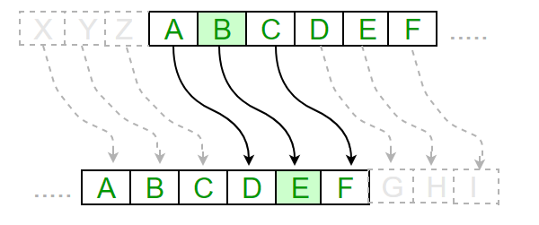
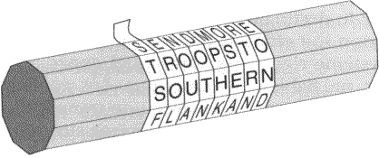
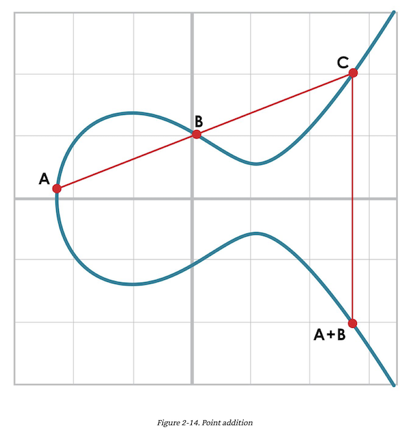
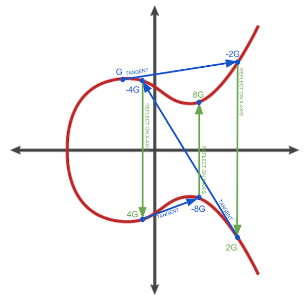
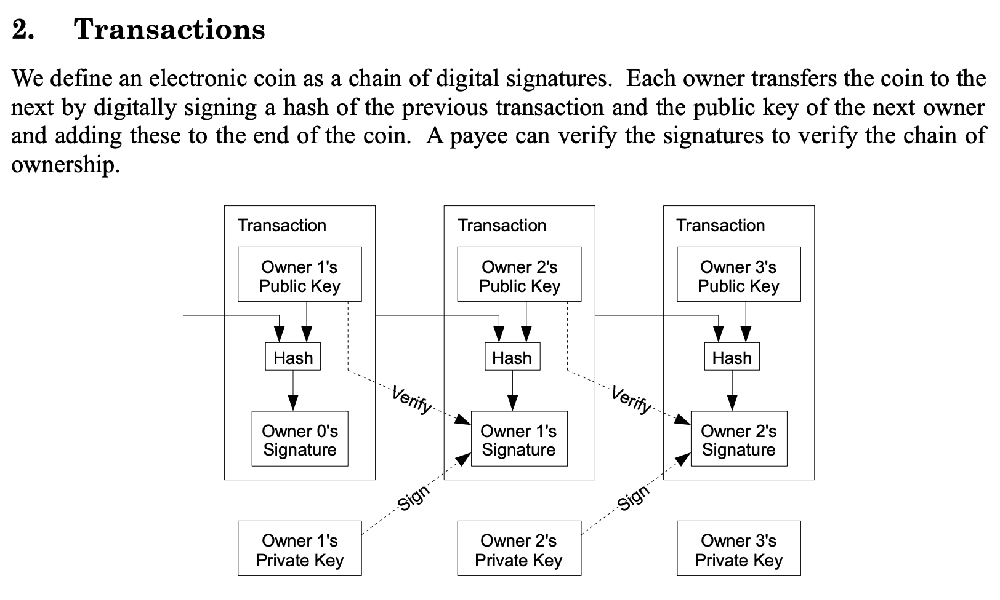

# Bitcoin 101 Series: Cryptography

While Proof-of-Work secures the entire network and the Bitcoin ledger, cryptography is what secures transactions between individuals.

## Table of contents
1. [History](#history)
2. [Modern Cryptography](#modern-cryptography)
    1. [Symmetric Ciphers](#symmetric-ciphers)
    2. [Asymmetric Ciphers, a.k.a. Public-Key Cryptography](#asymmetric-ciphers)
3. [Cryptography in Bitcoin](#bitcoin-cryptography)
    1. [ECDSA](#ecdsa)
    2. [Bitcoin’s Curve](#bitcoins-curve)
    3. [Public Keys and Addresses](#public-keys-and-addresses)
    4. [Caveats](#caveats)

## History 
The desire to keep (and share) secrets has existed probably as long as humans have lived. The earliest known usage of encryption goes back to [1900
BC](https://en.wikipedia.org/wiki/Encryption#History) in Egypt. Another famous encryption technique dated back to the Roman Empire, called the [Caesar
cipher](https://en.wikipedia.org/wiki/Caesar_cipher), used by Julius Caesar in his communication.

Classical ciphers, while vary a lot, fall mostly into 2 categories:

* [Substitution ciphers](https://en.wikipedia.org/wiki/Substitution_cipher): units of plaintext (usually single characters) are replaced according to some fixed rules. For example, in Caesar cipher: A->D, T->W, etc.

* [Transposition ciphers](https://en.wikipedia.org/wiki/Transposition_cipher): units of plaintext are shifted to different positions according to some fixed rules. For example, the “scytale”, used by ancient Greeks, wraps a strip of parchment around a rod with x faces (10 in picture below).

## Modern cryptography 

After WW2 and especially after the breaking of
[Enigma](https://en.wikipedia.org/wiki/Enigma_machine) — the Nazi’s favorite
encryption device — researchers began to look for better ways of doing
encryption. Classical ciphers operate mainly on the principle of
[security-through-obscurity](https://en.wikipedia.org/wiki/Security_through_obscurity)
(i.e., protect secrets by hiding the encryption schemes in some obscure ways).
These methods are highly vulnerable against
[cryptanalysis](https://en.wikipedia.org/wiki/Cryptanalysis) (the art of code breaking). By contrast, modern ciphers’ schemes are usually
public, not obscure. They follow the principle of **open security** or
**security-by-design**. Modern ciphers achieve security through the use of **secret keys**,
not the hiding of the encryption schemes. They are also often built on strong
mathematical foundations. Breaking them would require solving intractable math
problems.

Modern ciphers fall into 2 categories:

* Symmetric ciphers: the same key is used for encryption and decryption
* Asymmetric ciphers: different keys are used for encryption and decryption — one
for encryption (the public key), one for decryption (the private key). This is
also known as public-key cryptography.

### Symmetric Ciphers 

There are 2 types of symmetric ciphers: block ciphers and stream ciphers. An
example of block ciphers is
[AES](https://en.wikipedia.org/wiki/Advanced_Encryption_Standard), used by NSA
for top-secret information. An example of stream ciphers is
[Chacha20](https://en.wikipedia.org/wiki/Salsa20#ChaCha_variant), used by Google
to secure https traffic.

Symmetric ciphers typically use classical ciphers as their underlying building
blocks. For example, AES uses both substitution and transposition in multiple
rounds. See
[A Stick Figure Guide to the Advanced Encryption Standard (AES)](http://www.moserware.com/2009/09/stick-figure-guide-to-advanced.html) for a step-by-step walkthrough.

### Asymmetric Ciphers, a.k.a. Public-Key Cryptography 

The fundamental idea behind asymmetric ciphers is based on the
realization that in math, there are certain functions that seem
[one-way](https://en.wikipedia.org/wiki/One-way_function) (a.k.a. “trapdoor
functions”), meaning it is easy to compute the output given the inputs, but
super hard to calculate the inputs, given the output. This is still a theory,
proving that these functions exist would mean proving [P !=
NP](https://en.wikipedia.org/wiki/P_versus_NP_problem), the most famous problem
in Computer Science.

While the existence of one-way functions is only a theory, in practice it seems
to be true. For example, to calculate the product of 2 large prime numbers is
relatively easy, even by hand. But given the product, it is super hard, even
using a computer, to calculate what the original 2 prime numbers were.

**n = p * q — where (p, q) are 2 large prime numbers**

If you only know *n*, it is hard to calculate what *(p, q)* were.

This is the basis of asymmetric ciphers. For example, using the above function:

* **n could be used for encryption**.
* While **a number e, related to (p, q), and can only be calculated by knowing (p,
q), could be used for decryption**.

The *(n, e)* pair is known together as the **public key** — **private key**
pair.

* Anyone can encrypt messages by using the public key, *n*.
* But only the owner of the private key, *e*, could decrypt and read those
messages.

The scheme above is used by
[RSA](https://en.wikipedia.org/wiki/RSA_(cryptosystem)), one of the most widely
used asymmetric ciphers.

Public-key cryptography was invented in 1970s:

* Ellis & Cocks (1970–1973): classified research by the British government
* Diffie & Hellman (1976): first public discovery
* Rivest–Shamir–Adleman or RSA (1977), first implementation of Diffie & Hellman’s
idea

Besides integer/prime factorization, another math problem often used in
public-key cryptography is the **[discrete
log problem](https://en.wikipedia.org/wiki/Discrete_logarithm#Cryptography)**.
That is:

*bx* = *a*

Find x, given a base *b* and a number *a*.

It is similar to the prime factorization problem: easy to go one way, hard to go
the other way.

**Asymmetric ciphers have 2 main use cases**:

* Use the public key to **encrypt messages**. Only the owner of the private key
can decrypt those messages.
* Use the private key to **generate digital signatures**. A message can be
“signed” with the owner’s private key, while everyone can verify that only the
owner can generate that signature by checking against his/her public key.
(Bitcoin transactions employ this use case.)

## Cryptography in Bitcoin 

### ECDSA (Elliptic Curve Digital Signature Algorithm) 

Bitcoin uses a variant of public-key cryptography called [elliptic-curve
cryptography](https://en.wikipedia.org/wiki/Elliptic-curve_cryptography) (ECC).
The particular algorithm used is
[ECDSA](https://en.wikipedia.org/wiki/Elliptic_Curve_Digital_Signature_Algorithm).

Cracking ECDSA means solving the “elliptic curve discrete logarithm problem”
(ECDLP). Similar to other one-way functions, it is super hard, and there is no
known solution besides brute-forcing.

“The security of elliptic curve cryptography depends on the ability to
compute a point multiplication and the inability to compute the multiplicand
given the original and product points.” - Wikipedia

**To understand why ECDSA is in the same category as the other one-way functions, one must understand ECC math.** ECC defines its own math. Just like “normal” algebra, it has addition and
multiplication. But instead of working over numbers, these operations operate on
points on the curve. For example, here is how addition is defined:

To calculate the sum of point A and point B, one would draw a line through A and B. This line will intersect the curve at a third point, called point C. The reflection of point C over the y-axis is the sum of point A and point B.

To calculate the sum of point A and itself (point-doubling), one would draw a line through A that is tangent to the curve. This line will also intersect the curve at another point D. The reflection of point D over the y-axis is the doubling of point A.

Rules like these might seem arbitrary, but this theoretical world has many interesting properties that normal math doesn't have.

When you perform point addition (and point multiplication) in elliptic curve,
you are essentially bouncing around on the curve.

**The single most important operation we need to remember with ECC is the scalar multiplication.** Note again that this is not
“normal” algebra multiplication, but [elliptic-curve point
multiplication](https://en.wikipedia.org/wiki/Elliptic_curve_point_multiplication).

**P = e*G**

Whereas:

* P is the public key, which is a point on the curve, so it has a x-coordinate and
a y-coordinate
* e is the private key — a scalar, meaning it is a regular number, not a point on
the curve
* G is the generator point, also a point on the curve — all public keys in Bitcoin
share the same generator point, only the scalar is different

If you want to calculate the private key (e), given the public key (P) and the
generator point (G), you would need to solve the elliptic-curve discrete log
problem.

The diagram below illustrates how you can quickly generate points on the curve by
keeping doubling G: 2G, 4G, 8G etc. 5G, for example, can be calculated by adding 4G to G.

In actual cryptography applications, elliptic curves are defined over a finite field.
Think of a finite field as a modulo operation: the values don’t go to infinity
but wrap around when they beyond a certain number. For example, over the finite
field of 11, values greater than 11 would “wrap around” 11. 13 becomes 2 (13 mod
11 = 2), 115 becomes 5 (115 mod 11 = 5). A point on the curve whose coordinates
are (13, 115) would become (2, 5).

Because the number of values in a finite field is “finite”, that means **if you
keep adding G to itself over a finite field, at some point, you will come back
to the original point.** This forms a group:

**{G, 2G, 3G, 4G, …, nG} where nG = 0**

*Note: zero in elliptic curve is called the “point at infinity”. Think of it as
the point where a vertical line intersects the curve for the 3rd time (it is an
artificial point on a 2D plane, but does exist in higher dimensions).

So **nG = 0 means that point G and point (n-1)G forms a vertical line**.

### Bitcoin’s Curve 

Here are details of Bitcoin's elliptic curve, secp256k1:

* y2 = x3 + 7
* Prime number p = 2256 - 232 - 977
* Generator point G coordinates: (0x79be667ef9dcbbac55a06295ce870b07029bfcdb2dce28d959f2815b16f81798, 0x483ada7726a3c4655da4fbfc0e1108a8fd17b448a68554199c47d08ffb10d4b8)
* Order of the group generated by G: 0xfffffffffffffffffffffffffffffffebaaedce6af48a03bbfd25e8cd0364141

**The order of the group is the number of
all potential public key-private key pairs you can generate from G**.

This number for Bitcoin is close to 2²⁵⁶, an unimaginably
large number! Or as Jimmy Song put it: “**there are as many possible private
keys in Bitcoin as there are atoms in a billion galaxies.**”

### Public Keys and Addresses 

In the early days of Bitcoin, a person’s public keys are almost synonymous with
his Bitcoin “addresses”.

To send bitcoins to someone, you would ask that person for their public key. You
would then construct a transaction sending coins to that public key.

Only the owner of the corresponding private key can “unlock” the coins under
that public key.

In fact, that is precisely how Satoshi described Bitcoin transactions in his
white paper.

However, since Satoshi’s days, “addresses” have evolved significantly. **Almost
no one uses public keys directly as addresses anymore** (a.k.a.
Pay-to-Public-Key or P2PK transactions).

Nowadays, “addresses” can involve some transformation of the public keys (their
hashes, a.k.a. Pay-to-Public-Key-Hash or P2PKH), but not public keys themselves.
“Addresses” could also involve complicated smart contracts known as “scripts”
(e.g. Pay-to-Script-Hash or P2SH). For more on this, read [keys are not enough](https://github.com/nunchuk-io/nunchuk-journal/blob/main/keys-are-not-enough.md).

### Caveats 

Using public-key cryptography comes with certain caveats:

* ECDSA must generate a random number *k* for every single message, and you **must
not use the same k for 2 different messages**. If you do, an attacker can deduce
the private key. This is what happened in the Sony Playstation 3 hack
([https://en.wikipedia.org/wiki/Random_number_generator_attack#PlayStation_3](https://en.wikipedia.org/wiki/Random_number_generator_attack#PlayStation_3))
and the Android wallets vulnerability that resulted in stolen bitcoins
([https://bitcoin.org/en/alert/2013-08-11-android](https://bitcoin.org/en/alert/2013-08-11-android)).
In both of these cases, the PRNG (Pseudo-random-number-generator) of the
underlying system failed to generate a new random number for each message.
* Public-key cryptography is slower for encryption, compared to symmetric ciphers.
Therefore, in practice asymmetric ciphers are combined with symmetric ciphers
into a suite.
* Some elliptic curves are easier to crack. Choosing the right curve and
parameters is crucial (crypto experts only).
* Some elliptic-curve algorithms have potential backdoors:
[https://en.wikipedia.org/wiki/Dual_EC_DRBG#Weakness:_a_potential_backdoor](https://en.wikipedia.org/wiki/Dual_EC_DRBG#Weakness:_a_potential_backdoor)
* ECDSA algorithm is hacky/inelegant, due to patent issues. It is not the most
efficient ECC algorithm. **Schnorr signature** is much better. It is expected
that the Bitcoin network will replace ECDSA signature with Schnorr signature in
the near future.
* Four conditions are necessary for secure ECDSA signatures (section 3.4): “ECDSA and QUARTZ in Comparison with RSA”, Patrick Lieb, Markus Schmidt,
Alexander Wiesmaier, 2016:
[https://www.semanticscholar.org/paper/ECDSA-and-QUARTZ-in-Comparison-with-RSA-Lieb-Schmidt/0b85b94e4d4d90d1410a80eb5a03d2e654e47e6b](https://www.semanticscholar.org/paper/ECDSA-and-QUARTZ-in-Comparison-with-RSA-Lieb-Schmidt/0b85b94e4d4d90d1410a80eb5a03d2e654e47e6b)

